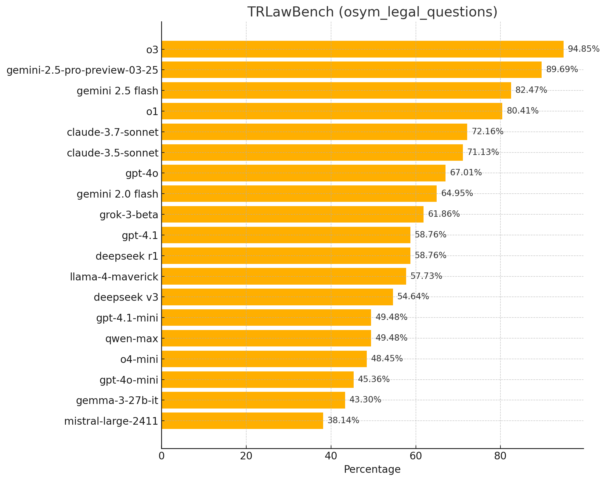

# TRLawBench

**TRLawBench**, büyük dil modellerinin Türk hukukundaki yeterliliklerini ölçmeyi amaçlayan bir benchmark çalışmasıdır.

## Veri Seti

ÖSYM tarafından yapılan **HMGS, İYÖS** ve **Adalet Bakanlığı sınavlarının** çıkmış sorularından oluşan **97 soruluk** bir veri seti kullanılmaktadır.

## Sonuçlar

| Model | Reasoning | Doğru | Yanlış | Başarı (%) |
|-------|-----------|-------|--------|------------|
| Google Gemma 4 31B IT | Kapalı | 59/97 | 38 | 60.82 |
| Google Gemma 4 31B IT | Açık | 69/97 | 28 | 71.13 |



## Kurulum ve Kullanım

```bash
# Bağımlılıkları yükle
uv sync

# .env dosyası oluştur
cp .env.example .env
# .env dosyasına OpenRouter API anahtarını yaz

# Benchmark'ı çalıştır
uv run benchmark.py --model "google/gemma-4-31b-it"

# Reasoning açık
uv run benchmark.py --model "google/gemma-4-31b-it" --reasoning

# Sessiz mod
uv run benchmark.py --model "google/gemma-4-31b-it" --quiet
```

### Parametreler

| Parametre | Açıklama | Varsayılan |
|-----------|----------|------------|
| `--model` | OpenRouter model adı | `google/gemma-3-27b-it` |
| `--reasoning` | Reasoning modunu etkinleştir | Kapalı |
| `--quiet` | Detaylı çıktıyı kapat | Kapalı |
| `--data` | Soru dosyası yolu | `data/osym_legal_questions.json` |
| `--api-key-env` | API anahtarı ortam değişkeni adı | `OPENROUTER_API_KEY` |

## Yol Haritası

- Çeşitli hukuk alanlarına özel soruları içeren veri setleri oluşturulacak
- Bilgiden ziyade muhakeme yeteneğini ölçen sorular eklenecek
- Açık uçlu sorular eklenecek
- Daha fazla model test edilecek

## Lisans

Bu veri seti sadece **eğitim ve test** amaçlıdır. **Ticari amaçlarla kullanılamaz.**
