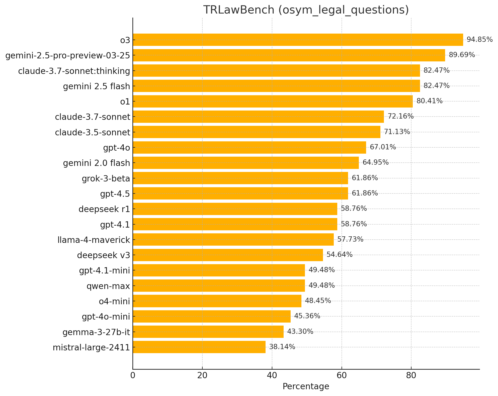

# TRLawBench

**TRLawBench**, büyük dil modellerinin Türk hukukundaki yeterliliklerini ölçmeyi amaçlayan bir benchmark çalışmasıdır.

## İlk Aşama

İlk aşamada, ÖSYM tarafından yapılan **HMGS, İYÖS** ve **Adalet Bakanlığı sınavlarının** çıkmış sorularından oluşan **97 soruluk bir veri seti** oluşturuldu. Bu veri setinde çeşitli güncel dil modellerinin performansı aşağıdaki grafikte görülebilir:

## Bu Tablo Ne Anlama Geliyor?

ÖSYM’nin soruları genellikle bilgiyi ölçmeye yönelik olduğu için, bu benchmark şu an için modellerin **Türk hukuku konusundaki bilgi düzeyini** test etmektedir.

## Yol Haritası

- Çeşitli hukuk alanlarına özel soruları içeren veri setleri oluşturulacak  
- Bilgiden ziyade muhakeme yeteneğini ölçen sorular eklenecek  
- Açık uçlu sorular eklenecek  
- Modellerin verdiği cevaplar listelenecek  
- Kullanılan test kodları paylaşılacak  

## Lisans

Bu veri seti sadece **eğitim ve test** amaçlıdır. **Ticari amaçlarla kullanılamaz.**
